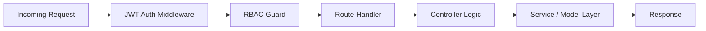
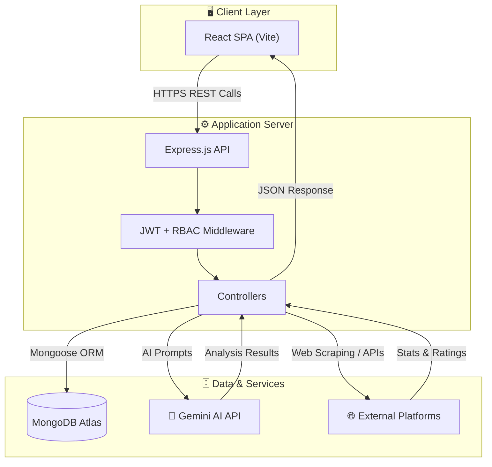

# System Architecture — AI-Powered Placement Preparation Portal

---

## Architecture Layers Breakdown

### 1️⃣ Client Layer — React.js + Vite

The frontend is a Single Page Application (SPA) built with **React.js** and bundled using **Vite** for fast hot-module replacement during development.

| Component | Purpose |
|:---|:---|
| **Student Dashboard** | Personalized view showing Placement Readiness Index, learning calendar, coding stats, and notifications |
| **Monaco Code Editor** | In-browser IDE supporting 14 languages (C, C++, Java, Python, JS, SQL, etc.) with syntax highlighting and auto-completion |
| **Live Web Preview** | Sandboxed `iframe` rendering for HTML/CSS/JS and React code with real-time visual feedback |
| **AI Resume Builder** | Upload, parse, and analyze resumes with AI-driven skill gap detection |
| **Mock Interview UI** | Interactive AI-generated interview sessions with real-time feedback |
| **Aptitude Tests** | Timed MCQ assessments across Quant, Logical, Verbal, and CS fundamentals |
| **Admin Console** | User management, bulk job posting, question importing, academic tracking, and CSV report generation |
| **Leaderboard** | Unified ranking system aggregating coding contest scores and platform statistics |

---

### 2️⃣ Application Server — Node.js + Express.js

The backend follows an **MVC architecture** with RESTful API endpoints.

| Component | Role |
|:---|:---|
| **JWT Authentication** | Stateless token-based auth using `jsonwebtoken`; passwords hashed with `bcryptjs` (salt rounds = 10) |
| **RBAC Middleware** | `protect` and `authorize('admin')` guards enforce role-specific route access (Student / Faculty / Admin) |
| **Controllers** | Modular handlers for Auth, Coding, Aptitude, Resume, Interview, Jobs, and Admin operations |
| **Route Handlers** | RESTful endpoints mapped under `/api/v1/*` namespace |
| **Socket.IO** | Real-time WebSocket communication for live notifications and contest updates |

---

### 3️⃣ Database Layer — MongoDB (Atlas)

A NoSQL document database chosen for its flexible schema design and horizontal scalability.

| Collection | Key Fields |
|:---|:---|
| **Users** | name, email, password (hashed), role, rollNumber, branch, graduationYear, sgpaSem1–sgpaSem8, resumeUrl, platformHandles |
| **Jobs** | title, company, description, requirements[], location, salary, experienceLevel, applyLink, targetBatch |
| **Tests & Questions** | category, difficulty, questionPool[] (with options, correctAnswer, explanation), timer, maxAttempts |
| **Submissions** | userId, problemId, language, code, executionTime, correctness, timestamp |
| **Coding Stats** | solvedCount, ratings, badges, difficulty breakdown (Easy/Medium/Hard), per-platform metrics |
| **Academic Records** | SGPA per semester, calculated CGPA, attendance, placement eligibility flags |

---

### 4️⃣ AI Services Layer

Powered by **Google Gemini API** for intelligent, context-aware analysis.

| Service | Function |
|:---|:---|
| **Resume NLP Analysis** | Extracts text from uploaded PDFs (`pdf-parse`), compares skills against job requirements, and scores structure out of 100 |
| **Skill Gap Analyzer** | Identifies missing keywords and technologies a student should add to qualify for target roles |
| **Mock Interview Generator** | Dynamically creates 10 context-matched questions (Technical / HR / Behavioral) based on candidate profile and target role |
| **Feedback Engine** | Evaluates student answers against technical benchmarks, generates sub-grades, and computes overall interview readiness score |

---

### 5️⃣ External Platform Integrations

Auto-sync competitive programming profiles to maintain a unified performance dashboard.

| Platform | Data Synced |
|:---|:---|
| **LeetCode** | Solved count, difficulty breakdown, contest rating, badges |
| **Codeforces** | Rating, rank, solved problems, contest history |
| **CodeChef** | Stars (e.g., 3★), rating, solved count |
| **HackerRank** | Badges, scores, certificates |
| **Nodemailer** | Email notifications for job postings, contest reminders, and placement drive alerts |

> [!NOTE]
> The sync engine includes **fault-tolerant fallback generators** to handle Cloudflare blocks, API rate limits, and remote endpoint failures — ensuring dashboard stats render continuously even when external APIs are unavailable.

---

## Data Flow Summary

---

## Technology Stack Summary

| Layer | Technologies |
|:---|:---|
| **Frontend** | React.js, Vite, Monaco Editor, Socket.IO Client, CSS3 (dark theme) |
| **Backend** | Node.js, Express.js, JWT, bcryptjs, Multer, pdf-parse |
| **Database** | MongoDB Atlas, Mongoose ODM |
| **AI/ML** | Google Gemini API, NLP prompt engineering |
| **External** | LeetCode, Codeforces, CodeChef, HackerRank APIs |
| **DevOps** | Nodemailer, dotenv, CORS, start.bat (local orchestration) |
